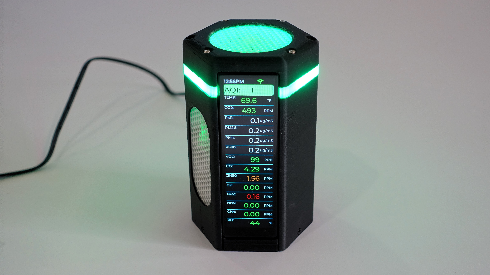

# HALO: The Air Quality Sensor That Smells Trouble Before You Do

Welcome to HALO — your hilariously over-engineered, open-source buddy who sniffs the air so you don’t have to. Designed for folks who care about the air they breathe but also want a sensor with personality, HALO operates on WiFi via ESPHome, which means no creepy cloud subscriptions or hidden fees. It’s just you, HALO, and your dusty air duking it out together.

---

## Features? Oh, HALO’s Got a Few Good Ones:

- **PM (Particulate Madness):** HALO tracks dust, pollen, and those mysterious floating things in the air. From “small but annoying” (PM2.5) to “call-the-vacuum” (PM10), HALO’s on it.
- **Sniffs Like a Dog:** HALO detects VOCs, CO₂, and gases like Ammonia, Ethanol, Methane, and Hydrogen. Basically, it’s like having a science lab shoved into a tiny box.
- **Weather Nerd:** HALO keeps tabs on temperature, humidity, and air pressure. It’s not your local weather station — it’s cooler.
- **Party Mode:** An eleven RGB LED HALO for air quality notifications or impromptu raves. Who said clean air can’t be fun?
- **Bluetooth Tracker:** HALO can help automate your home or, you know, find your keys if they’re Bluetooth-enabled.
- **Bluetooth & WiFi Powerhouse:** Includes BLE 5 + BT Mesh for seamless device integration and WiFi connectivity so HALO is always in the loop.
- **Touch of Brilliance:** A shiny new 3.4″ 640px × 180px LCD touchscreen for easy navigation and monitoring. Control HALO like a pro without even opening an app!

---

## Hardware Components

HALO is built with a powerhouse of components designed to sniff out, measure, and display air quality data with style. Here’s what makes HALO tick:

### MCU (Microcontroller Unit)
- **LILYGO T-Display-Long-S3:** The brains behind HALO, featuring an ESP32S3, a Dual-core LX7 MCU with a 3.4″ LCD touchscreen for easy interaction and a whole lot of smarts.

### Sensors
- **SCD-41:**
  - Measures CO₂ levels so you know when to crack a window open.
  - Tracks temperature because no one likes surprises.
  - Monitors humidity to keep your comfort levels in check.
- **SEN54 (or SEN55):**
  - Detects particulate matter: PM1, PM2.5, PM4, and PM10 (basically, HALO counts all the tiny stufflets floating around).
  - Measures VOC (Volatile Organic Compounds) to warn you about sketchy smells.
  - Also tracks temperature and humidity for full environmental awareness.
- **BME280:**
  - Keeps tabs on temperature, pressure, and humidity, because precision matters.
- **MIC4514:**
  - Sniffs out gases like:
    - CO (Carbon Monoxide)
    - C₂H₅OH (Ethanol)
    - H₂ (Hydrogen)
    - NO₂ (Nitrogen Dioxide)
    - NH₃ (Ammonia)
    - CH₄ (Methane)
- **Neopixels (11-LED Ring):**
  - 11x RGB LEDs to keep you visually updated on your air quality — or to add some flair to your desk.

---

## Plug & Play? More Like Plug & Pray (Kidding — It’s Easy):

1. **Power Up:** Plug HALO into a decent USB-C power brick. If HALO starts rebooting like it’s stuck in a bad WiFi loop, blame your cheap charger. HALO deserves better.
2. **Find HALO’s Hotspot:** Look for the “HALO’s AP” network on your phone or computer. Connect, and voilà — HALO’s dashboard appears. If it doesn’t, just type `http://192.168.4.1`. Because nothing says “high-tech” like typing an IP address.
3. **Join Your WiFi:** Tell HALO your WiFi name and password. Pro tip: Maybe don’t name your WiFi “NSA Surveillance Van.” HALO’s judgment-free, but still.

---

## Home Assistant Integration: Because HALO Plays Well With Others

1. Add HALO to Home Assistant using ESPHome.
2. When prompted, click things like “Adopt” and “Submit.” It’s basically adopting a pet rock, except HALO is useful.
3. Give HALO a home area (kitchen, bedroom, dungeon — no judgment).

---

## What Does HALO Measure? Everything.

- **Particulates:** PM10, PM2.5, PM4, and PM1 – tiny ones you didn’t know existed. HALO’s the Sherlock Holmes of dust.
- **Gases:** From Nitrogen Dioxide (NO₂) to the Ammonia from your cat’s litter box, HALO’s got a nose for trouble.
- **Humidity & Temp:** Whether you’re sweating or freezing, HALO knows.
- **CO₂:** If your room feels stuffy, HALO will call you out.

---

## Fun Extras:

- **RGB Light Show:** HALO’s RGB LED halo can flash when your air quality is trash. It’s like HALO’s saying, “Get it together, human!”
- **Self-Calibrating Genius:** Just take HALO outside, and it’ll calibrate itself. HALO loves fresh air, too.

---

## Troubleshooting? Call the HALO Hotline (AKA, Join Our Discord)

If HALO misbehaves, pop into our Discord for tips, tricks, and memes. HALO doesn’t judge your air, so don’t judge HALO’s quirks.

---

## Why HALO?

Because life’s too short for bad air and boring gadgets. HALO makes clean air monitoring fun, fabulous, and a little ridiculous.

### Open-Source for Open Minds
We love tinkerers, dreamers, and anyone who thinks, “You know what HALO really needs? A coffee maker attachment.” That’s why we’ve shared HALO’s software and CAD files with the world. Dive into our GitHub, unleash your inner mad scientist, and share your creations on Discord. Who knows? Your idea might just inspire HALO 2.0.

- **Build Instructions:** [https://github.com/yashmulgaonkar/halo/wiki](https://github.com/yashmulgaonkar/halo/wiki)
- **Discord:** [HALO Community](https://discord.com/channels/1309649507310506115/1309649802811670669)

---

<strong>HALO: The sensor you didn’t know you needed — but now can’t live without.</strong>

